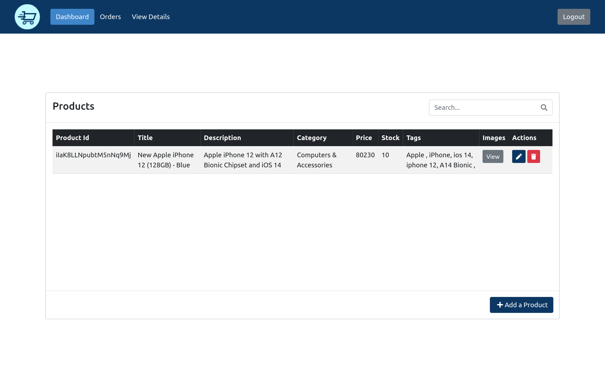
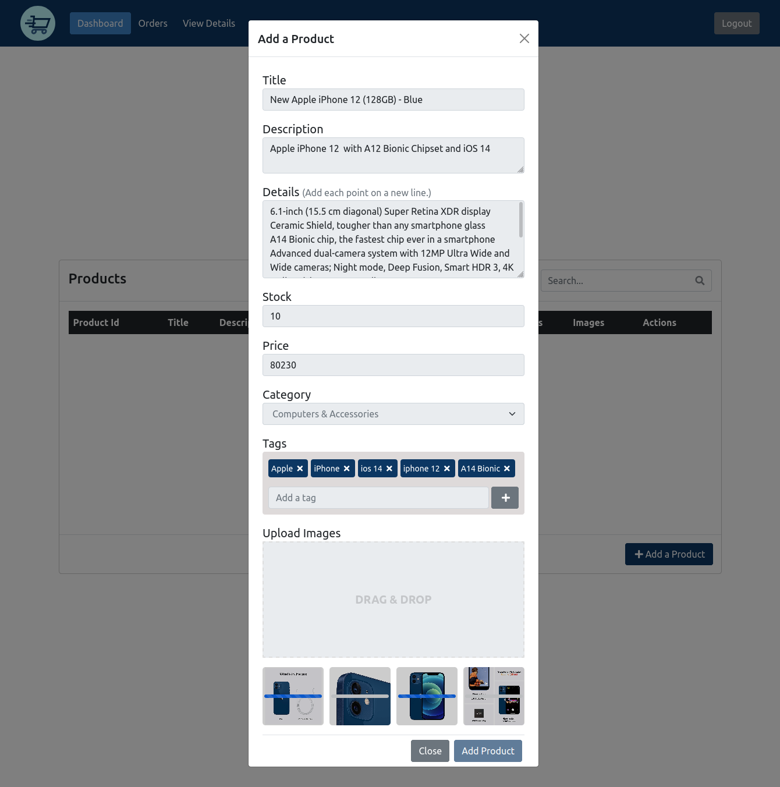

# E-commerce Seller
## BCA Final Year Project.

Topic: HYBRID WEB AND MOBILE APP FOR ONLINE STORE

This is the seller side application of our final year project for Bachelors of Computer Application (BCA) titled 'Hybrid Web and Mobile App For Online Store'.

## Live Demo

Check it out @ [SpeedWaGoan Seller](http://seller-speedwagoan.web.app/)

## Features
* Manage Products
* View Orders
* Manage Seller Details

## Build With
* [ReactJS](https://reactjs.org/)
* [Firebase](https://firebase.google.com/) 
* [Bootstrap](https://getbootstrap.com/)

## Client-side repo
Check out the client side of our e-commerce app @ [Speedwagoan](https://github.com/joseito-terence/speedwagoan)

## Screenshot

## Available Scripts

In the project directory, run:

### `npm i`

Installs all the dependancies.

### `npm start`

Runs the app in the development mode.\
Open [http://localhost:3000](http://localhost:3000) to view it in the browser.

The page will reload if you make edits.\
You will also see any lint errors in the console.

## Group Members
* R/BCA-18-118 - Charlton J. Dias
* R/BCA-18-201 - Aaron C. Fernandes
* R/BCA-18-202 - Shaun J. Barreto
* R/BCA-18-207 - Angel K. Fernandes
* R/BCA-18-208 - Joseito T. Fernandes